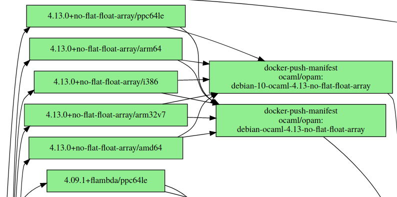
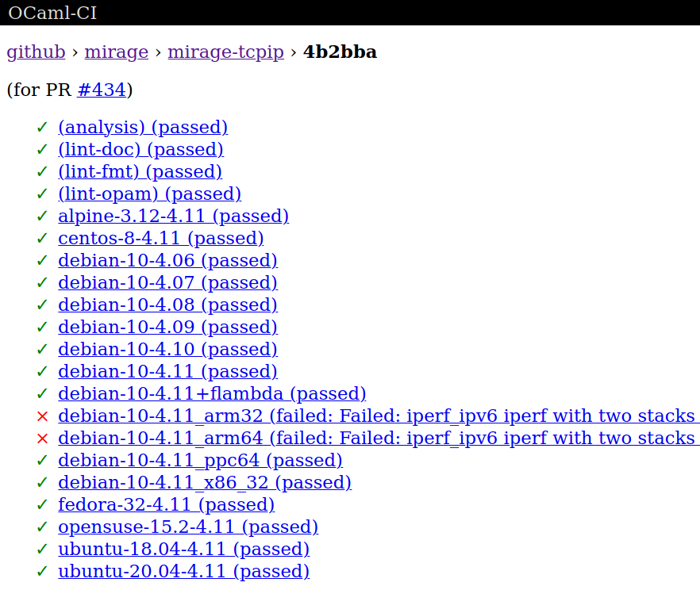
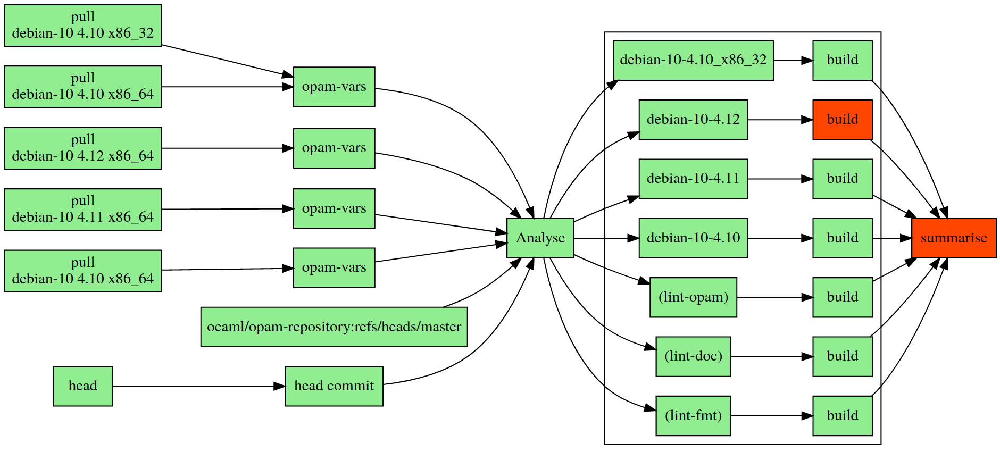
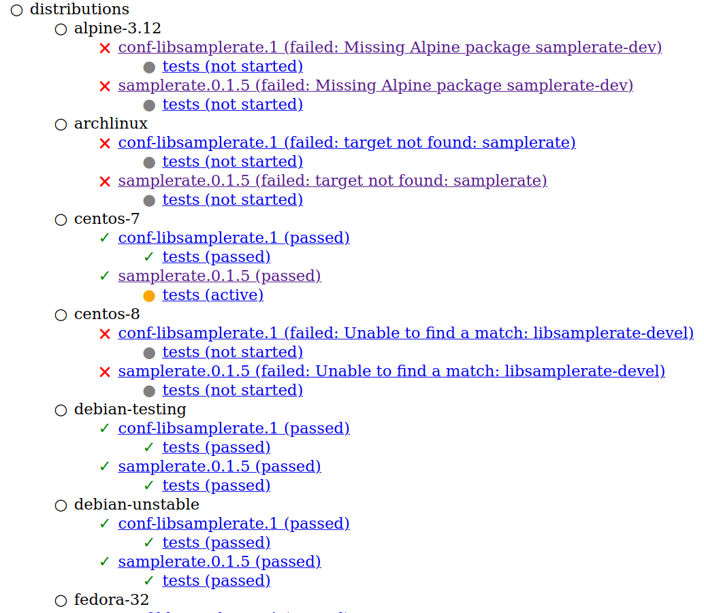
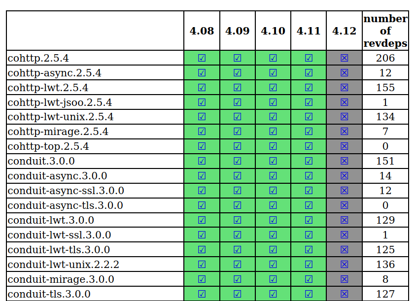
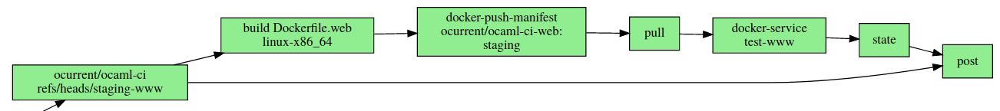
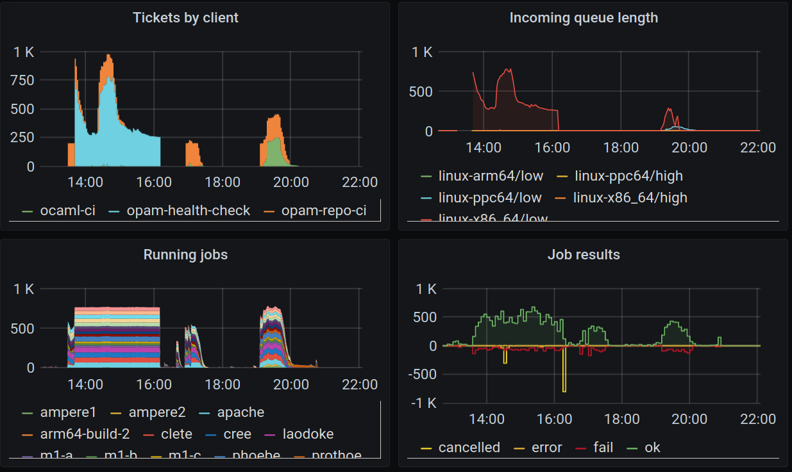
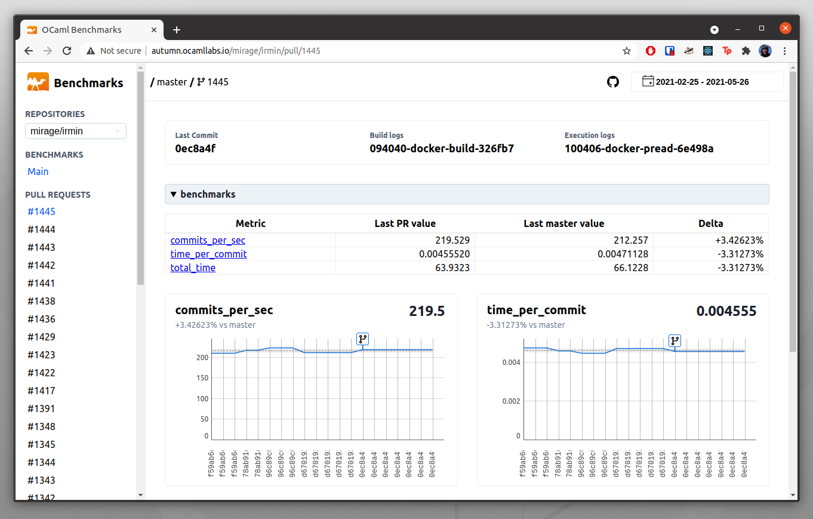

# Overview of the OCurrent organisation

There are a number of services providing CI for the OCaml community.
The services described here are:

- [docker-base-images][] -- builds the [ocaml/opam][] images on Docker Hub, which are used for CI
- [ocaml-ci][] -- CI for OCaml projects
- [opam-repo-ci][] -- CI for package submissions to [opam-repository][]
- [ocurrent-deployer][] -- builds and deploys the above services (and itself)
- [opam-health-check][] -- the opam-repository health checks at <http://check.ocamllabs.io/>
- [current-bench][] -- Continuous benchmarks for OCaml projects

Most of the services are [OCurrent][] pipelines, and all submit jobs to an [OCluster][]
build cluster, which has builders for x86, ARM and PowerPC architectures.
Each cluster builder uses [OBuilder][] to run the build jobs.
The various services communicate using [Cap'n Proto RPC][].

Most of the services are deployed using the [ocurrent-deployer][] service,
which is also an OCurrent pipeline.

## OCurrent pipelines

[OCurrent][] is an OCaml eDSL for creating processing pipelines.

<p align='center'>
  
</p>

For example, the pipeline shown above fetches the head of a GitHub repository's `master` branch,
builds it, runs the tests, and deploys the binary if the tests pass.
OCurrent pipelines are self-adjusting, so when the branch is updated, the pipeline will update automatically.

For more information on OCurrent, see:

- The [OCurrent wiki][] -- the official documentation
- [ocurrent-skeleton][] -- a template pipeline you can clone
- [CI/CD Pipelines: Monad, Arrow or Dart?][darts] -- background on OCurrent's design

## Docker images

The [docker-base-images][] service periodically builds Docker images for various Linux distributions,
OCaml versions, compiler flags, and architectures.

For example, if you want a Debian 10 system with OCaml 4.13 (trunk) installed,
configured with the `no-flat-float-array` option, you could do it like this:

```
# docker run --rm -it ocaml/opam:debian-10-ocaml-4.13-no-flat-float-array
$ ocaml -version
The OCaml toplevel, version 4.13.0+dev0-2020-10-19
```

Here is a detail from the pipeline, showing it building some of the Debian 10 / OCaml 4.13 images:

<p align='center'>
  
</p>

It uses the cluster to build images for `i386`, `x86_64`, `arm64`, `arm32` and `ppc64` architectures,
and then pushes a multi-arch image for them all to Docker Hub, under the tags `ocaml/opam:debian-10-ocaml-4.13-no-flat-float-array`
and (because Debian 10 is the latest version of Debian at the moment) `ocaml/opam:debian-ocaml-4.13-no-flat-float-array`.

The other services use these images for testing OCaml projects on the various platforms.

The service is running at <https://images.ci.ocaml.org/>, although users do not generally need to interact with it directly.

## Testing OCaml projects under development

An OCaml project can enable [ocaml-ci][] on its GitHub repository.
The CI examines the project's `opam` files to work out what needs to be built and which platforms the project supports.
It will then use the cluster to install and test the software on the supported platforms.
No configuration is needed besides enabling the service.
ocaml-ci aims to find problems in the software before it is released.

The CI engine provides a Cap'n Proto API, which is used to provide various user-interfaces:

- A web front-end, at <https://ci.ocamllabs.io/>
- A command-line interface (e.g. `ocaml-ci mirage/irmin refs/heads/master alpine-3.12-4.11 log` to show the log of the last build of the Irmin project's master branch on Alpine 3.12 with OCaml 4.11).
- [citty][], an interactive console application.

<p align='center'>
  
</p>

If you would like to try ocaml-ci on your project locally first (using a local Docker instance rather than a cluster),
you can run the `ocaml-ci-local` command to do that, e.g.

```
ocaml-ci-local /path/to/my-project
```

Then browse to <http://localhost:8080/> to see the state of the pipeline.
You'll see something like this:

<p align='center'>
  
</p>

This pipeline pulls in the Docker images for the various test platforms (here just a few versions of OCaml on Debian are shown),
fetches the latest version of opam-reposory, and gets the head commit of the project's current Git branch.
The Analyse step then runs a solver to find which packages are needed to build the head commit on each platform, using
opam-repository to get the versions.
Finally, it builds and tests on each supported platform.

## Publishing in opam-repository

A developer starts the release process by running [dune-release][], which
creates a GitHub release of the project and opens a PR on [opam-repository][].
[opam-repo-ci][] will then test each package in the release against the various supported platforms.
If these tests pass, it will also find all packages in the repository that depend on the newly released
package and build and test those too.

The running service can be found at <https://opam.ci.ocaml.org/github/ocaml/opam-repository>.

<p align='center'>
  
</p>

## Checking the health of opam-repository

Once a release has been accepted into opam-repository, [opam-health-check][] is run periodically to check
that all the packages still build.
It is also used when preparing a large change (such as making a new release of the OCaml compiler).

<p align='center'>
  
</p>

The results of the latest run can be seen at <http://check.ocamllabs.io/>.

## Updating services with the deployer

To deploy a new version of one of the above services, we push to a specific branch in the project's repository.
For example, to deploy a new version of docker-base-images, you push to the `live` branch in that repository.
The [ocurrent-deployer][] pipeline will detect this, build a new version of the service, push it to Docker Hub, and
then update the running service to that version.
It will post the status of the deployment to the `#ci-firehose` channel on the OCaml Labs Slack instance,
using OCurrent's Slack plugin.

This detail from the pipeline shows the deployment pipeline for the `staging-www` branch, which deploys that
branch to a staging location for testing changes to the web UI:

<p align='center'>
  
</p>

The services are mostly running under Docker SwarmKit, and are updated using OCurrent's Docker plugin.

There are deployer instances at <https://deploy.ocamllabs.io/> and <https://deploy.ci3.ocamllabs.io/>.

## Monitoring

Services export metrics using the [prometheus][] library, which are collected in a Prometheus service
and displayed using [grafana][].

<p align='center'>
  
</p>

## Benchmarking
An OCaml project can enable [current-bench][] on its GitHub repository. The repository needs to have a Makefile target named `bench`
since that is triggered inside the ocurrent pipeline in [current-bench][]. The repository also needs to emit the benchmarks in a JSON format so that they can be displayed on the [frontend](http://autumn.ocamllabs.io).

<p align='center'>

</p>

[ocaml-ci]: https://github.com/ocurrent/ocaml-ci
[opam-repo-ci]:https://github.com/ocurrent/opam-repo-ci
[opam-repository]: https://github.com/ocaml/opam-repository
[docker-base-images]: https://github.com/ocurrent/docker-base-images
[ocaml/opam]: https://hub.docker.com/r/ocaml/opam/tags
[opam-health-check]: https://github.com/ocurrent/opam-health-check
[OCluster]: https://github.com/ocurrent/ocluster
[OBuilder]: https://github.com/ocurrent/obuilder
[OCurrent]: https://github.com/ocurrent/ocurrent
[OCurrent wiki]: https://github.com/ocurrent/ocurrent/wiki
[ocurrent-skeleton]: https://github.com/ocurrent/ocurrent-skeleton
[ocurrent-deployer]: https://github.com/ocurrent/ocurrent-deployer
[Cap'n Proto RPC]: https://github.com/mirage/capnp-rpc
[citty]: https://github.com/ocurrent/citty
[dune-release]: https://github.com/ocamllabs/dune-release
[prometheus]: https://github.com/mirage/prometheus
[grafana]: https://grafana.com/
[darts]: https://roscidus.com/blog/blog/2019/11/14/cicd-pipelines/
[current-bench]: https://github.com/ocurrent/current-bench
